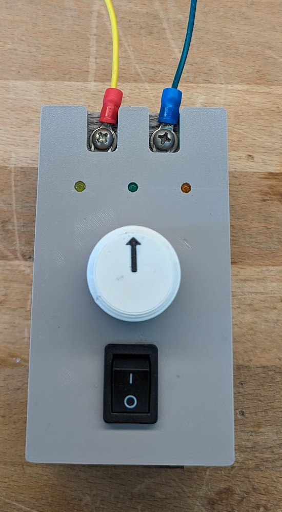

# PwmControlBox
## Epic Robots
## Nov 2023

This project is a simple box to control PWM for Talon devices.  It features self contained AA batteries, and
leds that mimic the leds on the Talon devices.

Also featured is super simple operation.  Simply turn the box on and twist the knob to 
control motor speed, with both forward and reverse provided.  

Connect the Yellow CAN wire to the left output terminal, and the Green CAN wire to the right output terminal.

The code also monitors the battery and blinks the green power LED when the batteries
start to ware out.  The faster the blink, the weaker the batteries are.  AA batteries  provide about
2 amp hours of capacity.  Based on a measured current draw of 50 milliamps, a pair of batteries should
provide about 40 hours of operation.

There are LEDS that indicate direction, one for reverse and one for forward.  If both leds are on
then the output is neutral (pulsewidth equal to 1500 microseconds). As speed increases in
either direction, the corresponding LED will stay on longer.   

The PWM frequency is about 300 HZ, as called for by the specifications for a Talon.  The minimum and maximum
pulsewidths are 950 and 2050 microseconds respectively.  Neutral is 1500 microseconds.  The knob has a 10% deadband at neutral.

The box is based on a Raspberry PICO microprocessor.  

